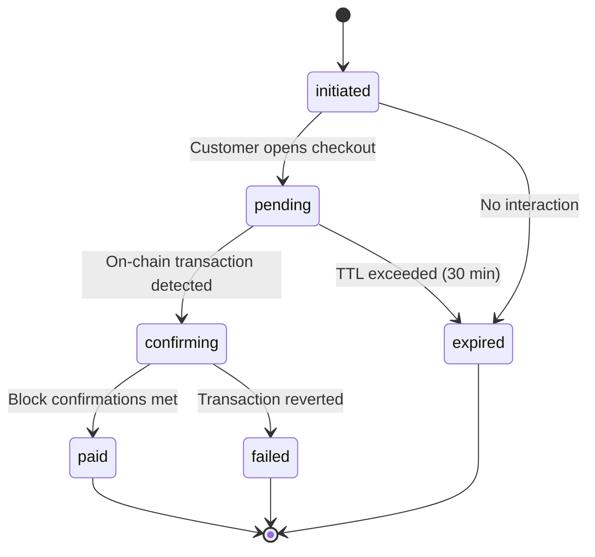

# Payment Lifecycle

Every payment in Open Pay follows a predictable lifecycle. This guide walks through each stage, from the moment a merchant creates a payment to the final webhook notification.

## Payment Status States



| Status | Description |
|---|---|
| `initiated` | Payment created, awaiting customer interaction |
| `pending` | Customer has opened the checkout page |
| `confirming` | Transaction detected on-chain, waiting for block confirmations |
| `paid` | Payment confirmed and settled |
| `failed` | Transaction reverted or rejected on-chain |
| `expired` | Payment TTL exceeded without completion (default: 30 minutes) |

## Step-by-Step Flow

<Steps>
  <Step title="Merchant Creates Payment">
    The merchant creates a payment via the API or an SDK. The response includes a `payment_id` and a `checkout_url`.

    <CodeGroup>
    ```bash cURL
    curl -X POST https://olp-api.nipuntheekshana.com/v1/payments \
      -H "Authorization: Bearer sk_live_..." \
      -H "Content-Type: application/json" \
      -d '{
        "amount": "25.00",
        "currency": "USD",
        "accepted_tokens": ["USDT", "USDC", "BNB"],
        "description": "Order #1042",
        "metadata": {
          "order_id": "1042",
          "customer_email": "buyer@example.com"
        }
      }'
    ```

    ```typescript TypeScript SDK
    import { OpenPay } from '@openpay/sdk';

    const client = new OpenPay({ apiKey: 'sk_live_...' });

    const payment = await client.payments.create({
      amount: '25.00',
      currency: 'USD',
      acceptedTokens: ['USDT', 'USDC', 'BNB'],
      description: 'Order #1042',
      metadata: {
        orderId: '1042',
        customerEmail: 'buyer@example.com',
      },
    });

    console.log(payment.checkoutUrl);
    ```

    ```go Go SDK
    payment, err := client.Payments.Create(ctx, &openpay.CreatePaymentParams{
        Amount:         "25.00",
        Currency:       "USD",
        AcceptedTokens: []string{"USDT", "USDC", "BNB"},
        Description:    "Order #1042",
        Metadata: map[string]string{
            "order_id":       "1042",
            "customer_email": "buyer@example.com",
        },
    })
    ```
    </CodeGroup>

    **Response:**
    ```json
    {
      "id": "pay_abc123",
      "status": "initiated",
      "amount": "25.00",
      "currency": "USD",
      "checkout_url": "https://olp-api.nipuntheekshana.com/checkout/pay_abc123",
      "expires_at": "2026-03-26T13:30:00Z",
      "created_at": "2026-03-26T13:00:00Z"
    }
    ```
  </Step>

  <Step title="Customer Sees Checkout Page">
    Redirect the customer to `checkout_url` or embed it in an iframe. The checkout page displays:
    - Order summary (amount, description)
    - Token selection (USDT, USDC, BNB)
    - QR code with the wallet address and exact amount
    - Countdown timer until expiration

    The payment status transitions from `initiated` to `pending` when the customer opens the checkout page.

    <Info>
      The QR code encodes a BEP-20 transfer with the exact token amount pre-filled, so the customer only needs to scan and confirm in their wallet.
    </Info>
  </Step>

  <Step title="Customer Sends Crypto">
    The customer scans the QR code or copies the wallet address and sends the payment from their crypto wallet. Supported tokens on BSC:

    | Token | Contract | Decimals |
    |---|---|---|
    | USDT | BEP-20 on BSC | 18 |
    | USDC | BEP-20 on BSC | 18 |
    | BNB | Native | 18 |

    <Warning>
      The customer must send the **exact amount** displayed. Partial payments are not accepted and will not be credited automatically.
    </Warning>
  </Step>

  <Step title="On-Chain Confirmation">
    Open Pay's provider service monitors the blockchain for incoming transactions. Once a matching transaction is detected:

    1. Status moves to `confirming`
    2. The platform waits for the required number of block confirmations (default: 12 blocks on BSC, approximately 36 seconds)
    3. The smart contract escrow verifies the amount matches using Chainlink price feeds

    <Info>
      For BNB payments, the Chainlink oracle converts the BNB amount to USD in real-time with configurable slippage tolerance (default: 1%).
    </Info>
  </Step>

  <Step title="Payment Confirmed & Settlement">
    Once block confirmations are met and the escrow contract validates the payment:

    1. Payment status moves to `paid`
    2. Funds are held in the merchant's settlement balance
    3. The merchant can withdraw to their configured wallet or bank account

    You can check the payment status at any time:

    ```bash
    curl https://olp-api.nipuntheekshana.com/v1/payments/pay_abc123 \
      -H "Authorization: Bearer sk_live_..."
    ```
  </Step>

  <Step title="Webhook Notification">
    Open Pay fires a `payment.completed` webhook to the merchant's configured endpoint. The payload is signed with ED25519 for verification.

    ```json
    {
      "event": "payment.completed",
      "payment_id": "pay_abc123",
      "status": "paid",
      "amount": "25.00",
      "currency": "USD",
      "token": "USDT",
      "tx_hash": "0xabc123...",
      "paid_at": "2026-03-26T13:02:15Z",
      "metadata": {
        "order_id": "1042",
        "customer_email": "buyer@example.com"
      }
    }
    ```

    <Tip>
      Always verify the webhook signature before processing. See the [Webhooks Guide](/guides/webhooks) for implementation details.
    </Tip>
  </Step>
</Steps>

## Polling vs Webhooks

You can track payment status using two approaches:

<Tabs>
  <Tab title="Webhooks (Recommended)">
    Configure a webhook endpoint and listen for `payment.completed`, `payment.failed`, or `payment.expired` events. This is the most efficient and reliable approach.

    ```typescript
    app.post('/webhooks/openpay', (req, res) => {
      const isValid = verifySignature(req);
      if (!isValid) return res.status(401).send('Invalid signature');

      const { event, payment_id, status } = req.body;

      if (event === 'payment.completed') {
        // Fulfill the order
      }

      res.status(200).send('OK');
    });
    ```
  </Tab>
  <Tab title="Polling">
    Poll `GET /v1/payments/:id` at regular intervals. Use this as a fallback or for simple integrations.

    ```typescript
    async function waitForPayment(paymentId: string): Promise<string> {
      const maxAttempts = 60;
      for (let i = 0; i < maxAttempts; i++) {
        const payment = await client.payments.get(paymentId);

        if (['paid', 'failed', 'expired'].includes(payment.status)) {
          return payment.status;
        }

        await new Promise(r => setTimeout(r, 5000)); // Poll every 5s
      }
      throw new Error('Payment polling timed out');
    }
    ```

    <Warning>
      Polling is subject to rate limits. Do not poll more frequently than once every 3 seconds. See [Error Handling](/guides/error-handling) for rate limit details.
    </Warning>
  </Tab>
</Tabs>

## Handling Edge Cases

<AccordionGroup>
  <Accordion title="Payment Expires">
    If the customer does not complete the payment within the TTL (default 30 minutes), the status moves to `expired`. You can create a new payment and redirect the customer again.
  </Accordion>
  <Accordion title="Underpayment">
    If the customer sends less than the required amount, the payment remains in `pending`. The checkout page will show the remaining balance. If the TTL expires, the partial amount is refunded automatically.
  </Accordion>
  <Accordion title="Overpayment">
    If the customer sends more than required, the payment is marked `paid` for the original amount. The excess is credited to the merchant's settlement balance.
  </Accordion>
  <Accordion title="Network Congestion">
    During high network congestion, block confirmations may take longer. The `confirming` state will persist until the required confirmations are met. The TTL timer pauses once a transaction is detected on-chain.
  </Accordion>
</AccordionGroup>
