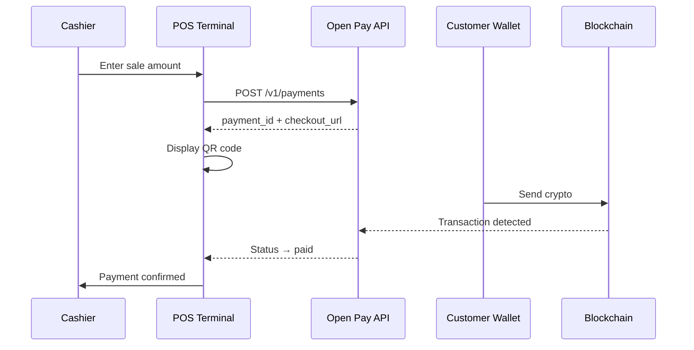

# Point of Sale Integration

Open Pay supports in-person crypto payments at retail locations. This guide covers how to integrate Open Pay into a point-of-sale (POS) terminal or kiosk using the API.

## How It Works



## Integration Steps

<Steps>
  <Step title="Create a Payment">
    When the cashier finalizes the sale, your POS application calls the API to create a payment.

    ```bash
    curl -X POST https://olp-api.nipuntheekshana.com/v1/payments \
      -H "Authorization: Bearer sk_live_..." \
      -H "Content-Type: application/json" \
      -d '{
        "amount": "12.50",
        "currency": "USD",
        "accepted_tokens": ["USDT", "USDC", "BNB"],
        "description": "POS Sale - Register 3",
        "ttl": 600,
        "metadata": {
          "branch_id": "branch_001",
          "register": "3",
          "receipt_number": "R-20260326-0042"
        }
      }'
    ```

    <Info>
      Set a shorter `ttl` (time-to-live) for POS payments. 600 seconds (10 minutes) is a good default for in-person transactions. The maximum is 1800 seconds (30 minutes).
    </Info>
  </Step>

  <Step title="Display the QR Code">
    Use the `checkout_url` from the response to render a QR code on the POS display. Customers scan it with their crypto wallet.

    ```typescript
    import QRCode from 'qrcode';

    async function displayPaymentQR(checkoutUrl: string) {
      // Generate QR code as data URL for display on screen
      const qrDataUrl = await QRCode.toDataURL(checkoutUrl, {
        width: 400,
        margin: 2,
        color: { dark: '#000000', light: '#FFFFFF' },
      });

      // Render on your POS display
      posScreen.showQR(qrDataUrl);
      posScreen.showText('Scan to pay with crypto');
    }
    ```

    Alternatively, the checkout page itself renders a QR code. You can display the `checkout_url` in a webview on the customer-facing screen.
  </Step>

  <Step title="Wait for Payment Confirmation">
    Poll the payment status or use webhooks to detect when the customer pays.

    <Tabs>
      <Tab title="Polling (Simpler)">
        Poll `GET /v1/payments/:id` every 3-5 seconds until the status reaches a terminal state.

        ```typescript
        async function pollPaymentStatus(paymentId: string): Promise<string> {
          const endpoint = `https://olp-api.nipuntheekshana.com/v1/payments/${paymentId}`;

          while (true) {
            const res = await fetch(endpoint, {
              headers: { Authorization: 'Bearer sk_live_...' },
            });
            const payment = await res.json();

            switch (payment.status) {
              case 'paid':
                posScreen.showSuccess('Payment received!');
                printReceipt(payment);
                return 'paid';

              case 'failed':
                posScreen.showError('Payment failed. Try again.');
                return 'failed';

              case 'expired':
                posScreen.showError('Payment expired.');
                return 'expired';

              default:
                // Still pending or confirming
                await new Promise(r => setTimeout(r, 4000));
            }
          }
        }
        ```
      </Tab>
      <Tab title="Webhooks (Recommended)">
        Set up a local webhook listener on your POS backend. This avoids repeated API calls and responds faster.

        ```typescript
        // POS backend webhook handler
        app.post('/pos/webhook', async (req, res) => {
          const isValid = await verifyWebhookSignature(req);
          if (!isValid) return res.status(401).send();

          const { event, data } = req.body;
          const { payment_id, metadata } = data;

          // Route the event to the correct register
          const register = metadata.register;

          if (event === 'payment.completed') {
            posRegisters[register].confirmPayment(payment_id);
          } else if (event === 'payment.expired') {
            posRegisters[register].expirePayment(payment_id);
          }

          res.status(200).send('OK');
        });
        ```
      </Tab>
    </Tabs>
  </Step>

  <Step title="Handle Timeout and Expiration">
    Display a countdown timer alongside the QR code. If the payment expires, give the cashier the option to create a new payment or cancel the sale.

    ```typescript
    function startExpirationTimer(expiresAt: string, paymentId: string) {
      const expiryTime = new Date(expiresAt).getTime();

      const interval = setInterval(() => {
        const remaining = expiryTime - Date.now();

        if (remaining <= 0) {
          clearInterval(interval);
          posScreen.showError('Payment expired');
          posScreen.showButton('Retry', () => createNewPayment());
          posScreen.showButton('Cancel Sale', () => cancelSale());
          return;
        }

        const minutes = Math.floor(remaining / 60000);
        const seconds = Math.floor((remaining % 60000) / 1000);
        posScreen.updateTimer(`${minutes}:${seconds.toString().padStart(2, '0')}`);
      }, 1000);
    }
    ```
  </Step>

  <Step title="Print Receipt">
    Once the payment is confirmed, print a receipt including the transaction hash for the customer's records.

    ```typescript
    function printReceipt(payment: Payment) {
      const receipt = {
        storeName: 'My Retail Store',
        branch: payment.metadata.branch_id,
        register: payment.metadata.register,
        receiptNumber: payment.metadata.receipt_number,
        amount: `${payment.amount} ${payment.currency}`,
        paidWith: payment.token,
        txHash: payment.tx_hash,
        date: new Date(payment.paid_at).toLocaleString(),
      };

      posPrinter.print(formatReceipt(receipt));
    }
    ```
  </Step>
</Steps>

## Example: Retail Store Flow

Here is a typical interaction at a retail checkout:

<AccordionGroup>
  <Accordion title="1. Cashier scans items and totals the sale">
    The POS system calculates the total: $12.50. The cashier selects "Pay with Crypto" as the payment method.
  </Accordion>
  <Accordion title="2. QR code appears on customer-facing display">
    The POS calls `POST /v1/payments` and renders a QR code. The display shows: "Scan to pay $12.50 in USDT, USDC, or BNB."
  </Accordion>
  <Accordion title="3. Customer scans and confirms in wallet">
    The customer opens Trust Wallet or MetaMask, scans the QR, reviews the amount, and confirms the transaction.
  </Accordion>
  <Accordion title="4. Payment confirms in ~30 seconds">
    The POS polls the API (or receives a webhook). After 12 block confirmations on BSC (~36s), the screen shows "Payment Confirmed" with a green checkmark.
  </Accordion>
  <Accordion title="5. Receipt prints automatically">
    A receipt prints with the store name, amount, token used, and the on-chain transaction hash as proof of payment.
  </Accordion>
</AccordionGroup>

## Branch Management

If your business has multiple locations, use the Branches API to organize payments by store:

```bash
# Create a branch
curl -X POST https://olp-api.nipuntheekshana.com/v1/merchants/me/branches \
  -H "Authorization: Bearer sk_live_..." \
  -H "Content-Type: application/json" \
  -d '{
    "name": "Downtown Store",
    "address": "42 Main St, Colombo",
    "metadata": { "register_count": "3" }
  }'
```

Include the `branch_id` in payment metadata to track revenue per location in the Merchant Portal.

## Hardware Recommendations

<CardGroup cols={2}>
  <Card title="Customer Display" icon="display">
    Any screen capable of rendering a QR code. Tablets, secondary monitors, or dedicated customer-facing displays all work.
  </Card>
  <Card title="Internet Connection" icon="wifi">
    A stable internet connection is required. Use a wired connection for reliability, with mobile data as fallback.
  </Card>
  <Card title="Receipt Printer" icon="print">
    Standard thermal receipt printers (ESC/POS compatible) work for printing transaction details.
  </Card>
  <Card title="Barcode Scanner" icon="barcode">
    Optional. Useful if the customer shows a wallet address QR for refunds or loyalty tracking.
  </Card>
</CardGroup>

<Warning>
  POS integrations should always include a fallback payment method (cash or card) in case of internet outage or blockchain network congestion.
</Warning>
