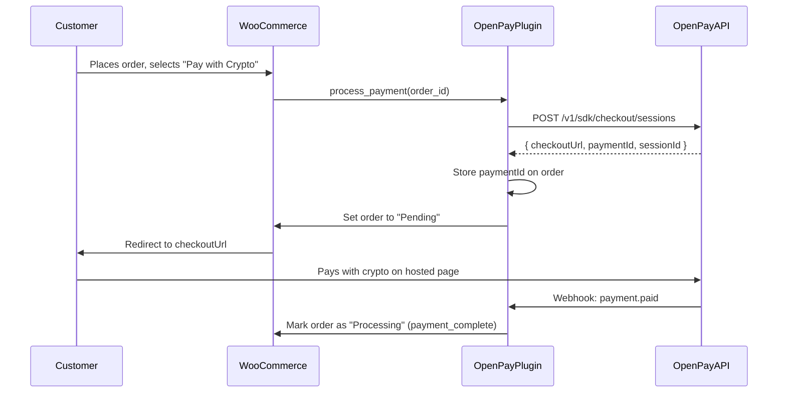

# WooCommerce Plugin

The **Open Pay for WooCommerce** plugin lets WordPress/WooCommerce stores accept cryptocurrency payments (USDT, USDC, BNB) that settle in LKR. Customers are redirected to a hosted checkout page to complete payment.

## Requirements

- WordPress 6.0+
- WooCommerce 8.0+
- PHP 8.1+
- An Open Pay merchant account with API credentials

## Installation

<Steps>
  <Step title="Download the Plugin">
    Download the plugin from the [GitHub repository](https://github.com/theetaz/open-pay) or clone it:

    ```bash
    cd wp-content/plugins/
    git clone https://github.com/theetaz/open-pay.git --sparse
    cd open-pay
    git sparse-checkout set plugins/woocommerce
    cp -r plugins/woocommerce ../openpay-gateway
    ```

    Alternatively, download the `openpay-gateway` folder and upload it to `wp-content/plugins/`.
  </Step>

  <Step title="Activate the Plugin">
    In your WordPress admin panel, go to **Plugins > Installed Plugins** and activate **Open Pay for WooCommerce**.

    <Warning>
      WooCommerce must be installed and active before activating the Open Pay plugin. The plugin will show an error notice if WooCommerce is not found.
    </Warning>
  </Step>

  <Step title="Configure API Credentials">
    Navigate to **WooCommerce > Settings > Payments > Open Pay** and enter your credentials:

    | Setting | Description |
    |---|---|
    | **Enable/Disable** | Toggle the payment gateway on or off |
    | **Title** | Payment method name shown to customers (default: "Pay with Crypto") |
    | **Description** | Description shown at checkout |
    | **API Key** | Your full API key in the format `ak_live_xxx.sk_live_yyy` |
    | **API Base URL** | API endpoint (default: `https://olp-api.nipuntheekshana.com`) |

    <Info>
      The API key field expects both the key ID and secret combined with a dot separator: `ak_live_xxx.sk_live_yyy`. Get this from the [Merchant Portal](https://olp-merchant.nipuntheekshana.com/integrations) under **Integrations**.
    </Info>
  </Step>

  <Step title="Configure the Webhook">
    In the Open Pay [Merchant Portal](https://olp-merchant.nipuntheekshana.com/integrations), configure your webhook URL to:

    ```
    https://yourstore.com/wc-api/openpay_webhook
    ```

    Subscribe to these events:
    - `payment.paid`
    - `payment.expired`
    - `payment.failed`

    <Tip>
      The webhook URL is displayed in the plugin settings page under the **Webhook** section for easy copying.
    </Tip>
  </Step>
</Steps>

## How It Works



<Steps>
  <Step title="Customer Checkout">
    The customer selects "Pay with Crypto" at checkout and clicks **Place Order**.
  </Step>
  <Step title="Session Creation">
    The plugin creates a checkout session via the Open Pay API with the order total, currency, line items, and callback URLs. The request is signed with HMAC-SHA256.
  </Step>
  <Step title="Redirect">
    The customer is redirected to the hosted Open Pay checkout page where they can select a cryptocurrency and complete payment.
  </Step>
  <Step title="Webhook Confirmation">
    When payment is confirmed on-chain, Open Pay sends a webhook to your store. The plugin updates the WooCommerce order status automatically.
  </Step>
</Steps>

## Checkout Session Payload

The plugin sends this data when creating a checkout session:

```json
{
  "amount": "49.99",
  "currency": "USD",
  "merchantTradeNo": "123",
  "successUrl": "https://yourstore.com/checkout/order-received/123/",
  "cancelUrl": "https://yourstore.com/cart/?cancel_order=true&order_id=123",
  "customerEmail": "customer@example.com",
  "lineItems": [
    {
      "name": "Premium Widget",
      "description": "Qty: 2",
      "amount": "49.99"
    }
  ],
  "expiresInMinutes": 15
}
```

## HMAC-SHA256 Request Signing

Every API request is signed automatically by the plugin:

```
signing_key = SHA256(api_secret)
message = timestamp + "POST" + "/v1/sdk/checkout/sessions" + json_body
signature = HMAC-SHA256(message, signing_key)
```

The following headers are sent:

| Header | Value |
|---|---|
| `Content-Type` | `application/json` |
| `x-api-key` | API key ID (`ak_live_xxx`) |
| `x-timestamp` | Unix timestamp in milliseconds |
| `x-signature` | HMAC-SHA256 hex signature |

## Order Status Mapping

The plugin maps Open Pay webhook events to WooCommerce order statuses:

| Webhook Event | WooCommerce Status | Description |
|---|---|---|
| *(order placed)* | **Pending payment** | Order created, awaiting crypto payment |
| `payment.paid` | **Processing** | Payment confirmed on-chain |
| `payment.expired` | **Cancelled** | Checkout session expired without payment |
| `payment.failed` | **Failed** | Payment transaction failed |

## Supported Currencies

The plugin sends the WooCommerce order currency to Open Pay. Supported fiat currencies for pricing:

| Currency | Code |
|---|---|
| US Dollar | `USD` |
| Sri Lankan Rupee | `LKR` |

Customers can pay with any supported cryptocurrency regardless of the store currency:

| Token | Network |
|---|---|
| USDT | BSC (BEP-20) |
| USDC | BSC (BEP-20) |
| BNB | BSC (Native) |

## HPOS Compatibility

The plugin declares compatibility with WooCommerce High-Performance Order Storage (HPOS / Custom Order Tables). It works with both the legacy `wp_posts` storage and the modern `wp_wc_orders` table.

## Troubleshooting

<AccordionGroup>
  <Accordion title="Plugin shows 'WooCommerce required' error">
    WooCommerce must be installed and activated before the Open Pay plugin. Go to **Plugins** and ensure WooCommerce is active, then deactivate and reactivate Open Pay.
  </Accordion>

  <Accordion title="'API request failed' on checkout">
    Check that your API key is correctly formatted as `ak_live_xxx.sk_live_yyy` in the plugin settings. Also verify that the API Base URL is reachable from your server. Test with:

    ```bash
    curl -I https://olp-api.nipuntheekshana.com/health
    ```
  </Accordion>

  <Accordion title="Webhooks not updating order status">
    Verify these items:

    1. **Webhook URL** is set correctly in the Merchant Portal: `https://yourstore.com/wc-api/openpay_webhook`
    2. **HTTPS** is required -- webhooks will not be sent to HTTP endpoints
    3. **Firewall** is not blocking incoming POST requests from Open Pay servers
    4. Check **WooCommerce > Status > Logs** for any error messages
  </Accordion>

  <Accordion title="Order stuck in 'Pending payment' status">
    This means the webhook has not been received yet. Possible causes:

    - The customer did not complete payment on the checkout page
    - The webhook URL is misconfigured
    - The checkout session expired (default: 15 minutes)

    Check the webhook delivery history in the Merchant Portal under **Integrations > Webhooks**.
  </Accordion>

  <Accordion title="'Unknown error' from Open Pay API">
    Enable WordPress debug logging to see the full API response:

    ```php
    // wp-config.php
    define('WP_DEBUG', true);
    define('WP_DEBUG_LOG', true);
    ```

    Check `wp-content/debug.log` for detailed error messages from the Open Pay API.
  </Accordion>
</AccordionGroup>
