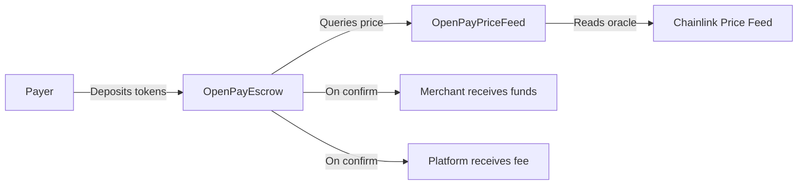
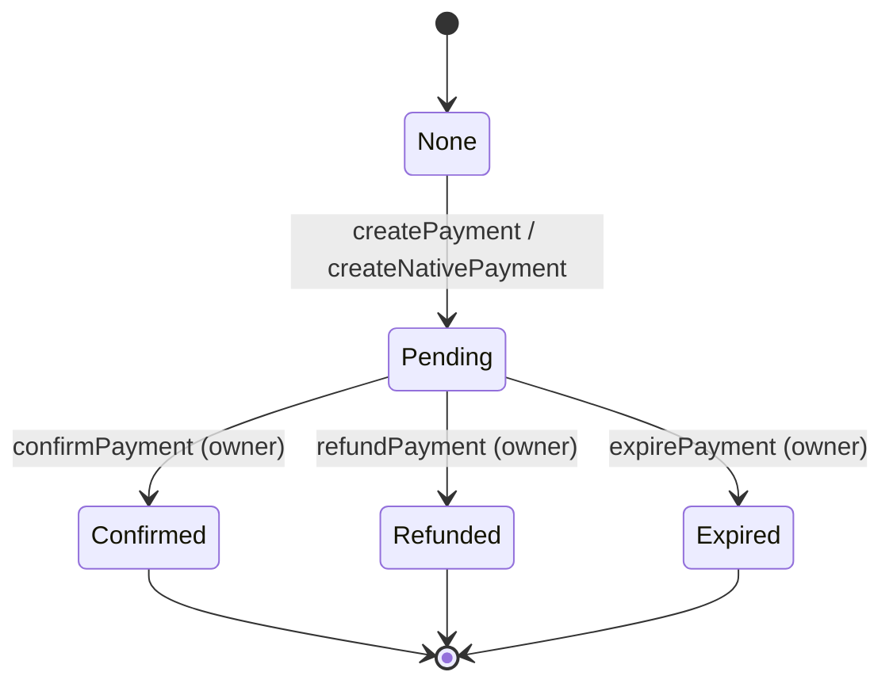

# Smart Contracts

Open Pay uses Solidity smart contracts deployed on **BSC Testnet (Chain ID 97)** to provide trustless, on-chain escrow for cryptocurrency payments. Funds are held in escrow until the merchant confirms delivery, at which point they are released automatically.

## Architecture

## Deployed Contracts

All contracts are deployed on **BSC Testnet** (Chain ID `97`).

| Contract | Address | Purpose |
|---|---|---|
| **OpenPayEscrow** | `0xe50464081b781AFE101EB40bC7e68Fd017c5e8f2` | Payment escrow with fee splitting |
| **OpenPayPriceFeed** | `0x1f34e070D4BB1eD3AaF37D8E3297b0a9A12a3399` | Chainlink oracle price aggregation |
| **MockUSDT** | Testnet token | Test USDT (18 decimals) |
| **MockUSDC** | Testnet token | Test USDC (18 decimals) |
| **MockPriceFeed** | Testnet contract | Simulated Chainlink feed for testing |

<Info>
  These are **testnet** deployments. For mainnet, you would deploy to BSC Mainnet (Chain ID 56) with real Chainlink price feeds and verified token addresses.
</Info>

## Key Features

<CardGroup cols={2}>
  <Card title="Escrow Payments" icon="lock">
    Funds are held securely in the smart contract until the payment is confirmed, refunded, or expired. No party can unilaterally withdraw.
  </Card>
  <Card title="Multi-Currency" icon="coins">
    Accept USDT, USDC, and BNB. The price feed converts USD amounts to token amounts in real time.
  </Card>
  <Card title="Chainlink Oracles" icon="link">
    Real-time price data from Chainlink decentralized oracles ensures accurate USD-to-token conversion with staleness protection.
  </Card>
  <Card title="Platform Fees" icon="percent">
    Automatic 2% platform fee (200 basis points) deducted on payment confirmation and sent to the fee recipient address.
  </Card>
</CardGroup>

## Payment Lifecycle

Every payment moves through a defined state machine:

| Status | Value | Description |
|---|---|---|
| `None` | 0 | Payment does not exist |
| `Pending` | 1 | Funds deposited, awaiting confirmation |
| `Confirmed` | 2 | Merchant paid, fee deducted |
| `Refunded` | 3 | Funds returned to payer |
| `Expired` | 4 | Payment timed out, funds returned |

## Security

The contracts use battle-tested OpenZeppelin libraries:

- **ReentrancyGuard** -- prevents reentrancy attacks on all payment functions
- **SafeERC20** -- safe token transfer wrappers that handle non-standard ERC-20 tokens
- **Ownable** -- only the contract owner can confirm, refund, or expire payments

## How It Works

<Steps>
  <Step title="Quote">
    The backend calls `getQuote(token, usdAmount)` on the escrow contract to get the exact token amount needed, including slippage bounds.
  </Step>
  <Step title="Deposit">
    The payer calls `createPayment()` (for ERC-20 tokens) or `createNativePayment()` (for BNB) with the payment ID, merchant address, and token amount. Funds are transferred to the escrow contract.
  </Step>
  <Step title="Verify">
    The Open Pay backend monitors on-chain events. Once the `PaymentCreated` event is detected, the payment status is updated in the database.
  </Step>
  <Step title="Confirm">
    The contract owner (Open Pay backend) calls `confirmPayment()`. The escrow splits the funds: 98% to the merchant, 2% platform fee to the fee recipient.
  </Step>
</Steps>

## Next Steps

<CardGroup cols={2}>
  <Card title="Escrow Contract" icon="file-contract" href="/smart-contracts/escrow">
    Deep-dive into the OpenPayEscrow contract functions and events
  </Card>
  <Card title="Price Feed" icon="chart-line" href="/smart-contracts/price-feed">
    Understand the Chainlink oracle integration
  </Card>
  <Card title="Deployment Guide" icon="rocket" href="/smart-contracts/deployment">
    Deploy your own instance or add new tokens
  </Card>
</CardGroup>
