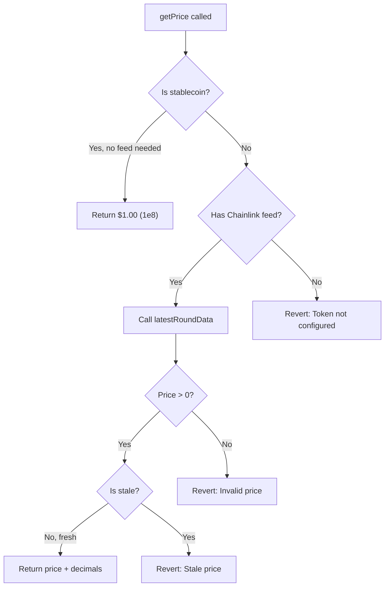

# OpenPayPriceFeed

The `OpenPayPriceFeed` contract aggregates price data from Chainlink decentralized oracles to convert between USD and token amounts. It includes stablecoin shortcuts and staleness protection.

**Address (BSC Testnet):** `0x1f34e070D4BB1eD3AaF37D8E3297b0a9A12a3399`

**Explorer:** [View on BscScan](https://testnet.bscscan.com/address/0x1f34e070D4BB1eD3AaF37D8E3297b0a9A12a3399)

## How It Works



## Key Design Decisions

<AccordionGroup>
  <Accordion title="Stablecoin Shortcut">
    Tokens marked as stablecoins (USDT, USDC) skip the oracle call entirely and return a fixed price of `$1.00` (represented as `100000000` with 8 decimals). This saves gas and avoids unnecessary oracle dependencies.
  </Accordion>
  <Accordion title="Staleness Protection">
    The contract rejects price data older than the `stalenessThreshold` (default: 3600 seconds / 1 hour). If the Chainlink oracle has not updated within this window, all price queries revert with "Stale price".
  </Accordion>
  <Accordion title="Native Token Support">
    BNB (native token, `address(0)`) uses a dedicated `nativeFeed` Chainlink oracle rather than the token config mapping. This is set separately via `setNativeFeed()`.
  </Accordion>
</AccordionGroup>

## Read Functions

### getPrice

Get the current USD price and decimal precision for a token.

```solidity
function getPrice(address token) external view returns (
    uint256 price,
    uint8 decimals_
)
```

| Parameter | Type | Description |
|---|---|---|
| `token` | `address` | Token address, or `address(0)` for native BNB |

| Return Value | Type | Description |
|---|---|---|
| `price` | `uint256` | USD price (scaled by 10^decimals) |
| `decimals_` | `uint8` | Price decimal precision (typically 8 for Chainlink) |

**Behavior:**
- For stablecoins: returns `(100000000, 8)` -- equivalent to $1.00
- For `address(0)`: queries the `nativeFeed` Chainlink oracle
- For other tokens: queries the token-specific Chainlink feed

### getAmountInToken

Convert a USD amount to the equivalent token amount at the current price.

```solidity
function getAmountInToken(address token, uint256 usdAmount) external view returns (uint256)
```

| Parameter | Type | Description |
|---|---|---|
| `token` | `address` | Token address |
| `usdAmount` | `uint256` | USD amount to convert |

**Example:** "How many BNB tokens do I need to pay $25?"

### getAmountInUsd

Convert a token amount to its USD equivalent at the current price.

```solidity
function getAmountInUsd(address token, uint256 tokenAmount) external view returns (uint256)
```

| Parameter | Type | Description |
|---|---|---|
| `token` | `address` | Token address |
| `tokenAmount` | `uint256` | Token amount to convert |

**Example:** "How much USD is 0.5 BNB worth?"

## Token Configuration

### configureToken

Register a token with its Chainlink price feed. **Owner only.**

```solidity
function configureToken(address token, address feed, bool isStablecoin) external onlyOwner
```

| Parameter | Type | Description |
|---|---|---|
| `token` | `address` | ERC-20 token address |
| `feed` | `address` | Chainlink price feed address (can be `address(0)` for stablecoins) |
| `isStablecoin` | `bool` | If `true`, returns fixed $1.00 price without oracle call |

**Example configurations:**

```solidity
// USDT - stablecoin, no oracle needed
priceFeed.configureToken(usdtAddress, address(0), true);

// USDC - stablecoin, no oracle needed
priceFeed.configureToken(usdcAddress, address(0), true);

// WBNB - volatile, needs Chainlink feed
priceFeed.configureToken(wbnbAddress, bnbUsdFeed, false);
```

### tokenConfigs

Read the configuration for a registered token.

```solidity
function tokenConfigs(address token) external view returns (
    address feed,
    bool isStablecoin,
    bool isConfigured
)
```

## Admin Functions (Owner Only)

### setNativeFeed

Set the Chainlink price feed for the native token (BNB).

```solidity
function setNativeFeed(address feed) external onlyOwner
```

### setStalenessThreshold

Set the maximum age (in seconds) for oracle price data. Minimum: 60 seconds.

```solidity
function setStalenessThreshold(uint256 threshold) external onlyOwner
```

<Warning>
  Setting the threshold too low may cause price queries to fail frequently during periods of low oracle update frequency. The default of 3600 seconds (1 hour) is appropriate for most use cases.
</Warning>

## State Variables

| Variable | Type | Default | Description |
|---|---|---|---|
| `nativeFeed` | `address` | -- | Chainlink BNB/USD feed address |
| `stalenessThreshold` | `uint256` | `3600` | Max oracle data age in seconds |

## Events

```solidity
event TokenConfigured(address indexed token, address feed, bool isStablecoin);
event NativeFeedUpdated(address oldFeed, address newFeed);
event StalenessUpdated(uint256 oldThreshold, uint256 newThreshold);
```

## Example: Querying Prices with ethers.js

```typescript
import { ethers } from "ethers";

const provider = new ethers.JsonRpcProvider("https://data-seed-prebsc-1-s1.bnbchain.org:8545");

const priceFeed = new ethers.Contract(
  "0x1f34e070D4BB1eD3AaF37D8E3297b0a9A12a3399",
  [
    "function getPrice(address) view returns (uint256 price, uint8 decimals_)",
    "function getAmountInToken(address, uint256) view returns (uint256)",
    "function getAmountInUsd(address, uint256) view returns (uint256)",
  ],
  provider
);

// Get BNB/USD price
const [price, decimals] = await priceFeed.getPrice(ethers.ZeroAddress);
console.log(`BNB price: $${ethers.formatUnits(price, decimals)}`);

// How much BNB for $50?
const bnbAmount = await priceFeed.getAmountInToken(
  ethers.ZeroAddress,
  ethers.parseUnits("50", 8) // USD with 8 decimals
);
console.log(`BNB needed for $50: ${ethers.formatEther(bnbAmount)}`);
```

## Chainlink Price Feeds Reference

For mainnet deployment, use the official Chainlink BSC feeds:

| Pair | Mainnet Feed | Testnet |
|---|---|---|
| BNB/USD | `0x0567F2323251f0Aab15c8dFb1967E4e8A7D42aeE` | MockPriceFeed |
| BTC/USD | `0x264990fbd0A4796A3E3d8E37C4d5F87a3aCa5Ebf` | MockPriceFeed |
| ETH/USD | `0x9ef1B8c0E4F7dc8bF5719Ea496883DC6401d5b2e` | MockPriceFeed |

<Tip>
  Find all available Chainlink feeds at [data.chain.link](https://data.chain.link/bsc/mainnet).
</Tip>
